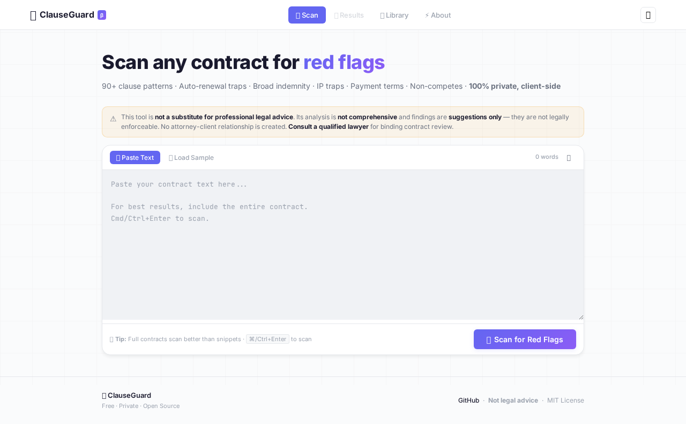
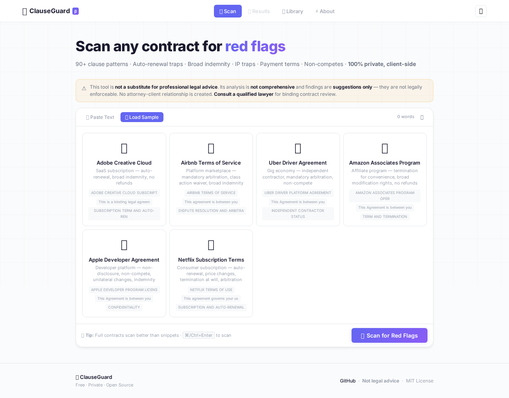

# 🛡️ ClauseGuard — Contract Red-Flag Scanner

**Paste any contract. Scan for 39 red-flag clause patterns across 15 categories. 100% client-side. Zero data leaves your browser.**

**[→ Live Demo](https://aieatassam.github.io/clause-guard/)**



*Click **Load Sample** to try with real contracts from Adobe, Airbnb, Uber, Amazon, Apple, and Netflix.*



> ⚠️ **IMPORTANT DISCLAIMER**
>
> **ClauseGuard is NOT legal advice.** It is an educational pattern-matching tool only.
>
> - **No attorney-client relationship** is created by using this tool
> - **The analysis is NOT comprehensive** — many risks cannot be detected by automated pattern matching
> - **Findings are suggestions only** and are NOT legally enforceable determinations
> - **Absence of a flag does NOT mean a contract is safe** — this tool cannot catch everything
> - **You should ALWAYS consult a qualified, licensed attorney** for contract review tailored to your specific circumstances, jurisdiction, and legal needs
>
> This tool helps you know what questions to ask your lawyer — it does not replace one.

## Features

- **39 specific clause patterns** across 15 categories — auto-renewal, indemnification, IP traps, payment terms, non-competes, and more
- **Severity-ranked results** — critical, high, medium, info
- **Annotated contract view** — see highlights inline
- **Export** — CSV summary or full HTML report
- **Dark/light theme** — respects system preference
- **Zero dependencies** — pure vanilla JS, fully static
- **100% private** — nothing leaves your browser, ever
- **Offline-ready** — works as a static site

## Pattern Library Coverage

| Category | Patterns | Category | Patterns |
|---|---|---|---|
| Auto-Renewal | 2 | Indemnification | 3 |
| Limitation of Liability | 2 | Assignment | 1 |
| Dispute Resolution | 3 | Termination | 3 |
| Payment Terms | 3 | Intellectual Property | 2 |
| Confidentiality | 2 | Non-Compete / Non-Solicit | 2 |
| Warranties | 1 | Force Majeure | 1 |
| Survival | 1 | Audit Rights | 1 |
| Miscellaneous | 12 | | |

## Quick Start

```bash
git clone https://github.com/AieatAssam/contract-scanner.git
cd contract-scanner
# Serve with any static server:
python3 -m http.server 8000
# or
npx serve .
```

Open `http://localhost:8000` in your browser.

## Deployment (GitHub Pages)

1. Push to `main` branch
2. Go to repo Settings → Pages
3. Source: Deploy from branch → `main` → `/ (root)`
4. Done

Or use the GitHub Actions deploy workflow:

```yaml
# .github/workflows/deploy.yml
name: Deploy to Pages
on:
  push:
    branches: [main]
jobs:
  deploy:
    runs-on: ubuntu-latest
    permissions:
      pages: write
      id-token: write
    steps:
      - uses: actions/checkout@v4
      - uses: actions/configure-pages@v5
      - uses: actions/upload-pages-artifact@v3
        with:
          path: '.'
      - uses: actions/deploy-pages@v4
```

## Limitations

- **Not legal advice.** This is a pattern-matching tool, not a substitute for professional legal review.
- **English only.** Patterns target English-language contracts.
- **Single contract per scan.** Large multi-document agreements may need section-by-section scanning.
- **False positives.** Some flagged terms may be appropriate depending on context. Always review findings with a professional.

## How It Works

1. **Paste** your contract text into the scanner
2. **Pattern matching** runs against 90+ regex patterns organized by clause type
3. **Results** are ranked by severity with explanations, risk levels, and suggested fixes
4. **Export** findings as CSV or HTML for your records

## Tech Stack

- Pure vanilla JavaScript (no frameworks)
- CSS custom properties (theming)
- No external dependencies
- No build step required
- Works offline (static HTML+CSS+JS)

## License

MIT

---


